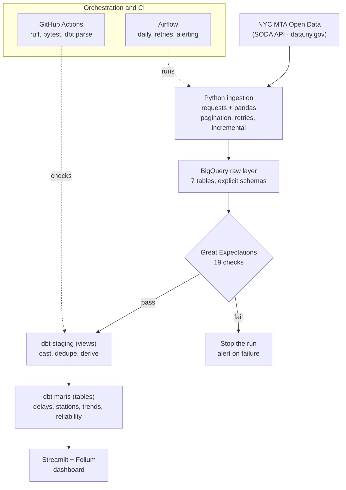

# Transit Pulse 🚇


[](LICENSE)

A data pipeline for NYC subway performance. It pulls seven MTA open-data feeds into
BigQuery, cleans and models them with dbt, checks them with Great Expectations, runs
the whole thing on a schedule with Airflow, and puts the results behind a Streamlit
dashboard with an interactive map.

I built it to work the way a real pipeline works rather than to look good in a
screenshot: explicit schemas, incremental loads, tested models, a data-quality gate
that actually blocks bad data, and CI that runs on every push. The dataset is about
91,000 rows of monthly performance metrics going back to 2015.

**[Live dashboard](https://transit-pulse.streamlit.app)** · deploy instructions below.

## Architecture



The Airflow DAG runs four tasks in order: ingest, validate, `dbt run`, `dbt test`.
Great Expectations sits between ingestion and dbt on purpose. If a raw table fails its
checks, the run stops there and the marts never get rebuilt from bad data.

## What it tracks

The MTA publishes subway performance as a handful of separate monthly datasets. This
pipeline pulls all of them and joins them into something you can actually read:

- On-time performance by line, split into weekday and weekend
- Wait assessment, which measures whether trains are evenly spaced (bunching is its own
  kind of misery even when the average headway looks fine)
- Customer journey time, peak versus off-peak
- Delays broken out by root cause
- Mean distance between failures, reported per car class, as a fleet-reliability signal
- Ridership by station, used to weight the map and size the markers
- A composite line-health score that blends on-time performance, wait assessment, and
  journey time into one number per line per month

A couple of things the data will tell you once it is loaded: the F train has the worst
on-time performance of any line (around 68% on weekdays), and the single best month in
the whole record is May 2020, when almost nobody was riding and the near-empty trains
ran close to schedule.

## Tech stack

| Tool | What it does here | Why it is a reasonable choice |
|---|---|---|
| Python 3.13 | Ingestion, validation, dashboard | Type hints, `logging`, linted with ruff |
| BigQuery | Warehouse for the raw, staging, and marts layers | Free tier covers 10 GB storage and 1 TB of queries a month, which is far more than this needs |
| dbt (BigQuery adapter) | SQL transformations, tests, and docs | Models live in version control and get tested on every run |
| Great Expectations | Data-quality checks on the raw tables | Declarative expectations that fail the pipeline instead of silently passing bad rows downstream |
| Airflow | Orchestration | Scheduling, retries, failure alerting, and a dependency graph you can point at in an interview |
| Streamlit, Plotly, Folium | The dashboard | Quick to build, free to host, and Folium handles the geospatial map |
| GitHub Actions | CI | Lint, unit tests, and an offline `dbt parse` on every push |

## Data source

Everything comes from [NYC Open Data](https://data.ny.gov), pulled through the free
Socrata (SODA) API. The MTA updates these datasets monthly. The full registry, with
IDs, schemas, natural keys, and the incremental strategy for each one, lives in
[`ingestion/config.py`](ingestion/config.py).

| Dataset | Socrata ID | Grain |
|---|---|---|
| Terminal on-time performance | `f6rf-2a3t` | line × month × day type |
| Customer journey metrics | `r7qk-6tcy` | line × month × period |
| Trains delayed | `9zbp-wz3y` | line × month × cause |
| Wait assessment | `s666-h6b7` | line × month × period |
| Mean distance between failures | `e2qc-xgxs` | car class × month |
| Subway stations (dimension) | `39hk-dx4f` | station |
| Station monthly ridership | `ak4z-sape` | station complex × month |

One thing worth flagging if you go looking for these yourself: the MTA reorganized its
performance datasets, and several older dataset IDs that show up in tutorials and blog
posts (including `nb36-cmmq` and `kk4q-3rt2`) no longer exist. The IDs above were
verified against the live API. The percentage-style metrics are also stored as
fractions between 0 and 1 rather than 0 to 100, which the schemas and the data-quality
bounds account for.

## Running it locally

You need a GCP project with the BigQuery API turned on and a service-account key with
BigQuery Admin, plus Python 3.13. A free [Socrata app token](https://data.ny.gov/signup)
is optional and only raises the rate limit.

```bash
# Set up the environment
python3.13 -m venv .venv && source .venv/bin/activate
pip install -r requirements.txt
cp .env.example .env        # fill in GCP_PROJECT_ID and GOOGLE_APPLICATION_CREDENTIALS

# Create the BigQuery datasets and raw tables
python scripts/setup_bigquery.py

# Load the data (add --dry-run to fetch without writing to BigQuery)
python -m ingestion.mta_ingest

# Run the data-quality checks
python -m data_quality.validate

# Build and test the dbt models
cd dbt_transit && dbt run && dbt test && cd ..

# Open the dashboard
streamlit run dashboard/app.py
```

After the first load, ingestion is incremental. It checks the most recent month already
in BigQuery and only fetches newer rows, so re-running it is cheap and safe.

### Running the pipeline in Airflow

```bash
cd airflow
mkdir -p logs plugins secrets
cp /path/to/gcp-key.json secrets/gcp-key.json
cp ../.env .env && echo "AIRFLOW_UID=$(id -u)" >> .env
docker compose up airflow-init      # first run only
docker compose up                   # UI at http://localhost:8080, login airflow / airflow
```

## The dashboard

Four pages, all reading from the BigQuery marts with a one-hour cache so nothing hits
the warehouse more than it needs to.

| Page | What is on it |
|---|---|
| Line performance | On-time performance ranked worst to best, reliability tiers, and trend lines over time |
| Station delay map | Every station on a Folium map, colored by its line's reliability and sized by ridership, with per-tier layers and click-through popups |
| Time trends | An on-time heatmap by line and month, rolling reliability, peak versus off-peak, and a year-over-year view |

The station map is the part I spent the most time on. It is the fastest way to see that
reliability is not evenly distributed across the city.

### Screenshots

Run `streamlit run dashboard/app.py`, then drop three PNGs into `docs/screenshots/`
named `station_map.png`, `line_performance.png`, and `time_trends.png`. Uncomment the
block below and they will show up here.

<!--
| Station delay map | Line performance | Time trends |
|---|---|---|
|  |  |  |
-->

## Data quality

There are two layers of checking, and they catch different things.

Great Expectations runs on the raw tables before dbt touches them. Nineteen checks
across four tables cover the obvious failure modes: null keys, on-time and wait and
journey values that fall outside 0 to 1, ridership outside a sane range, line names that
are not real MTA lines (including the shuttle codes, which are easy to miss), row counts
that look wrong, and a check that the ingestion timestamp is later than the reporting
month. The suites are in [`data_quality/suites.py`](data_quality/suites.py). If any of
them fail, the Airflow DAG stops before running dbt.

dbt adds 44 tests on the transformed models: `not_null` and `unique` on keys,
`accepted_values` for line names, `relationships` between staging and marts, and one
custom singular test,
[`assert_valid_otp_fraction`](dbt_transit/tests/assert_valid_otp_fraction.sql), that
re-checks the 0-to-1 bound after transformation. They all pass on every run, and CI runs
`dbt parse` to catch broken refs without needing warehouse credentials.

## Layout

```
transit-pulse/
├── ingestion/        SODA to BigQuery loader and the dataset registry
├── data_quality/     Great Expectations suites and the runner
├── dbt_transit/      staging (7 views), marts (4 tables), 44 tests
├── dashboard/        Streamlit app and the Folium map
├── airflow/          the ELT DAG and a LocalExecutor Docker Compose
├── scripts/          BigQuery setup
├── tests/            pytest unit tests, no network or warehouse needed
└── .github/          CI: ruff, pytest, dbt parse
```

## Things I would add next

- A live GTFS-RT feed for real-time delays instead of monthly snapshots
- A delay-prediction model on the monthly panel
- Incremental dbt materializations with `state:modified+` in CI against a prod target
- The same pipeline pointed at another city's transit data (CTA or BART both publish
  similar feeds)

## License

MIT. See [LICENSE](LICENSE).

Data comes from NYC Open Data. This project is not affiliated with the MTA.
