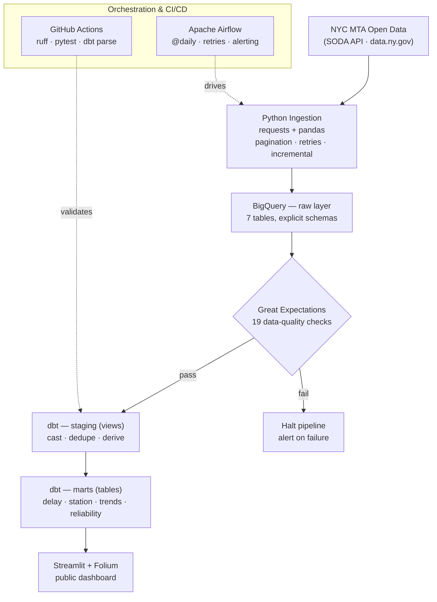

# Transit Pulse 🚇


&nbsp;**[Live Dashboard →](https://transit-pulse.streamlit.app)** *(deploy step below)*

An end-to-end **ELT analytics platform** for NYC MTA subway performance. It ingests
seven MTA open-data feeds into BigQuery, transforms them with dbt, gates them with
Great Expectations, orchestrates the whole pipeline with Airflow, and serves the
results through a multi-page Streamlit dashboard with an interactive Folium map — all
on free-tier infrastructure.

Built as a portfolio project to demonstrate a production-shaped data pipeline:
schema-explicit ingestion, tested transformations, data-quality gates, CI/CD, and a
public dashboard that turns 91K rows of raw performance data into something you can
actually explore.

## Architecture



The Airflow DAG runs `ingest → validate → dbt run → dbt test` daily; Great
Expectations sits between ingestion and transformation so bad data never reaches the
marts.

## Key metrics tracked

- **On-time performance** by line, month, and weekday/weekend
- **Mean distance between failures (MDBF)** — fleet reliability by car class
- **Wait assessment** — headway regularity (are trains evenly spaced?)
- **Customer journey time** — peak vs off-peak, share of trips within expected time
- **Delays** by line and root cause
- **Ridership** by station complex, for demand-weighting and map sizing
- A composite **line-health score** blending OTP, wait assessment, and journey time

## Tech stack

| Tool | Purpose | Why |
|---|---|---|
| **Python 3.13** | Ingestion, validation, dashboard | Type-hinted, `logging`, `ruff`-linted |
| **BigQuery** | Cloud data warehouse (raw → staging → marts) | Free 10 GB / 1 TB-query tier; serverless |
| **dbt (BigQuery adapter)** | SQL transformations + testing + docs | Version-controlled, tested, self-documenting models |
| **Great Expectations** | Data-quality gate on raw tables | Declarative expectations, fails the pipeline on bad data |
| **Apache Airflow** | Orchestration | Scheduling, retries, failure alerting, dependency DAG |
| **Streamlit + Plotly + Folium** | Interactive dashboard | Fast to build, free hosting, geospatial maps |
| **GitHub Actions** | CI/CD | Lint + tests + offline dbt parse on every push |

## Data source

[NYC Open Data](https://data.ny.gov) — MTA subway performance datasets (2015–present,
refreshed monthly), pulled via the free Socrata (SODA) API. The full dataset registry
(IDs, schemas, keys, incremental strategy) lives in
[`ingestion/config.py`](ingestion/config.py).

| Dataset | Socrata ID | Grain |
|---|---|---|
| Terminal on-time performance | `f6rf-2a3t` | line × month × day type |
| Customer journey metrics | `r7qk-6tcy` | line × month × period |
| Trains delayed | `9zbp-wz3y` | line × month × cause |
| Wait assessment | `s666-h6b7` | line × month × period |
| Mean distance between failures | `e2qc-xgxs` | car class × month |
| Subway stations (dimension) | `39hk-dx4f` | station |
| Station monthly ridership | `ak4z-sape` | station complex × month |

> **Note:** percent-like metrics (OTP, wait assessment, journey time) are stored by
> MTA as **0–1 fractions**, not 0–100 — the pipeline and data-quality bounds account
> for this.

## Getting started

**Prerequisites:** a GCP project with the BigQuery API enabled and a service-account
key (BigQuery Admin), plus Python 3.13. A free
[Socrata app token](https://data.ny.gov/signup) is optional (raises rate limits).

```bash
# 1. Environment
python3.13 -m venv .venv && source .venv/bin/activate
pip install -r requirements.txt
cp .env.example .env        # fill in GCP_PROJECT_ID + GOOGLE_APPLICATION_CREDENTIALS

# 2. Create BigQuery datasets + raw tables
python scripts/setup_bigquery.py

# 3. Ingest (all 7 datasets; incremental after first run)
python -m ingestion.mta_ingest          # add --dry-run to smoke-test without loading

# 4. Data-quality gate
python -m data_quality.validate

# 5. Transform + test
cd dbt_transit && dbt run && dbt test && cd ..

# 6. Dashboard
streamlit run dashboard/app.py
```

### Run the whole pipeline with Airflow (Docker)

```bash
cd airflow
mkdir -p logs plugins secrets
cp /path/to/gcp-key.json secrets/gcp-key.json
cp ../.env .env && echo "AIRFLOW_UID=$(id -u)" >> .env
docker compose up airflow-init      # first run only
docker compose up                   # UI at http://localhost:8080 (airflow/airflow)
```

## Dashboard

Three pages plus a KPI landing page, all reading cached BigQuery marts
(`@st.cache_data(ttl=3600)`):

| Page | What it shows |
|---|---|
| **Line Performance** | OTP ranking (worst→best), reliability tiers, trend lines |
| **Station Delay Map** | Folium map of every station, colored by line reliability, sized by ridership, with per-tier layers and popups |
| **Time Trends** | OTP heatmap (line × month), rolling reliability, peak vs off-peak, year-over-year |

### Screenshots

> 📸 Run `streamlit run dashboard/app.py`, then save three screenshots into
> `docs/screenshots/` as `station_map.png`, `line_performance.png`, and
> `time_trends.png`. Uncomment the table below and they'll render here.

<!--
| Station delay map | Line performance | Time trends |
|---|---|---|
|  |  |  |
-->


## Data quality

Two complementary layers:

- **Great Expectations** (raw layer, pre-transform) — 19 expectations across four
  tables: not-null keys, OTP/wait/journey bounds `[0, 1]`, ridership bounds, valid
  MTA line set (including shuttles), row-count sanity, and `_loaded_at > month`.
  Suites live in [`data_quality/suites.py`](data_quality/suites.py); failure halts
  the DAG before dbt runs.
- **dbt tests** (post-transform) — **44 tests**: `not_null` and `unique` on keys,
  `accepted_values` for line names, `relationships` between staging and marts, and a
  custom [`assert_valid_otp_fraction`](dbt_transit/tests/assert_valid_otp_fraction.sql)
  singular test. All pass on every run and via `dbt parse` in CI.

## Project structure

```
transit-pulse/
├── ingestion/        SODA → BigQuery loader + dataset registry
├── data_quality/     Great Expectations suites + runner
├── dbt_transit/      staging (7 views) + marts (4 tables) + 44 tests
├── dashboard/        Streamlit multi-page app + Folium map
├── airflow/          ELT DAG + LocalExecutor Docker Compose
├── scripts/          BigQuery setup
├── tests/            pytest unit tests (network-free, CI)
└── .github/          CI: ruff + pytest + dbt parse
```

## Future improvements

- Real-time **GTFS-RT** feed integration for live delay tracking
- **Predictive delay modeling** (gradient-boosted or sequence models on the monthly panel)
- **Incremental dbt materializations** with `state:modified+` in CI against a prod target
- Multi-city expansion (Chicago CTA, BART)

---

*Data: NYC Open Data (MTA). This project is not affiliated with the MTA.*
